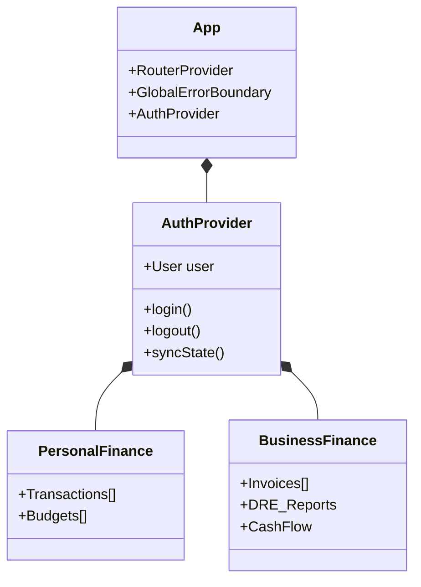
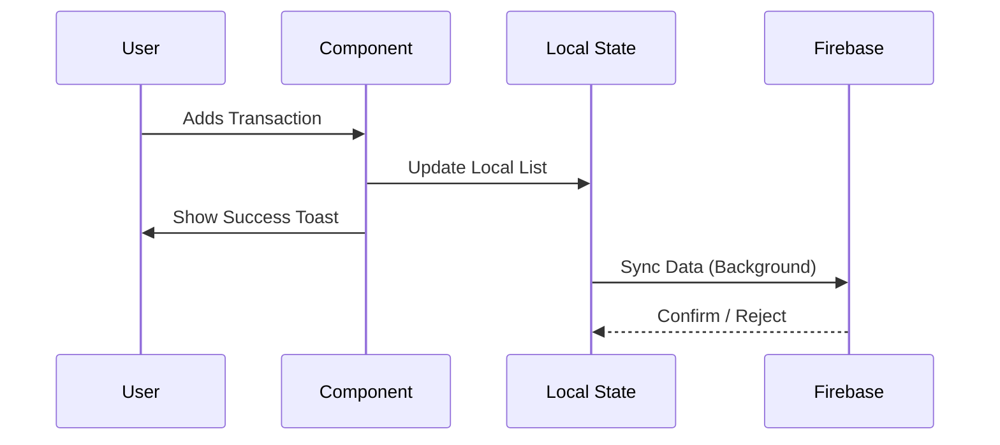

# System Architecture

## Overview

My Accountant (Meu Contador) is a **Progressive Web Application (PWA)** built for high-performance financial management. It follows a **Service-Oriented Frontend Architecture**.

## High-Level Design

```mermaid
graph TD
    User[User] -->|Interacts| UI[UI Layer (React/Vite)]
    UI -->|State Updates| Context[Context Layer]
    Context -->|Business Logic| Hooks[Custom Hooks]
    Hooks -->|Data Persistence| Storage[Storage Layer]
    Storage -->|Sync| Firebase[Firebase Cloud]
    Storage -->|Cache| LocalStorage[Local Storage]
```

## Component Architecture

The application is transitioning to a **Feature-Based Structure** to ensure scalability.



## Data Flow (Optimistic UI)

We use an **Optimistic UI** pattern. Actions (like adding a transaction) update the local state immediately, allowing for instant feedback, while the synchronization with Firebase happens in the background.



## Tech Stack

- **Core**: React 18, TypeScript 5, Vite
- **Styling**: Tailwind CSS, Shadcn/UI (Radix Primitives)
- **State**: React Context + Custom Hooks
- **Backend/Auth**: Firebase (Auth, Firestore)
- **Visuals**: Framer Motion
